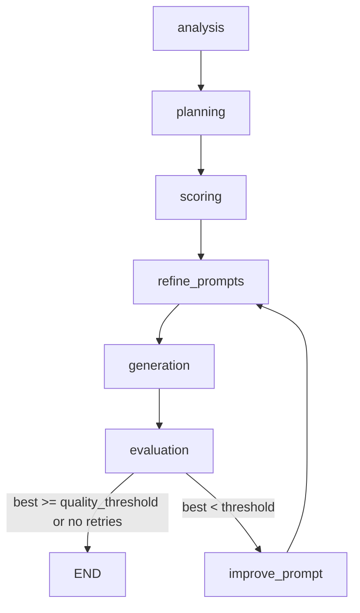

# AI Creative Studio

LangGraph pipeline: product photo → concepts → diffusion ad frames → ranked scores.

Entry points: `python main.py --image PATH` or `python -m uvicorn serve:app --host 0.0.0.0 --port 8080`. Models and backends are set in `config.yaml`.

---

## Pipeline



| Stage | Node | What happens | Model |
| --- | --- | --- | --- |
| 1 | `analysis` | VLM reads the packshot → `ProductAnalysis` JSON (category, OCR lines, colours, …) | **VLM** |
| 2 | `planning` | LLM invents N creative concepts (scene, light, style) | **LLM** (text) |
| 3 | `scoring` | LLM rates each concept; keep `top_k_concepts` | **LLM** |
| 4 | `refine_prompts` | LLM writes diffusion `positive_prompt` / `negative_prompt` | **LLM** |
| 5 | `generation` | Draw frames from refined prompts + product photo | **Diffusion** (not LLM/VLM) |
| 6 | `evaluation` | Metrics on PNGs; pick `best_image` | CLIP, DINO, Tesseract, optional **VLM-judge** |
| 7 | `quality_router` | If `best.score < quality_threshold` and retries left → `improve_prompt` then refine again | **LLM** on improve |

`generate_video` exists in the graph as a stub (placeholder paths), not a real video model.

On **CUDA**, `pipeline.keep_vlm: true` parks Qwen2.5-VL on CPU between stages (one disk load). On **Mac**, VLM is fully unloaded so the LLM/diffusion can use unified RAM.

---

## Which VLM / LLM / vision model

IDs below are the **current `config.yaml` CUDA / MLX defaults**. Change them there.

| Role | When | CUDA | Apple Silicon (MLX) |
| --- | --- | --- | --- |
| Product analysis | Stage 1 | `Qwen/Qwen2.5-VL-32B-Instruct` | `mlx-community/Qwen2-VL-2B-Instruct-4bit` |
| Concepts, concept scoring, prompt refine, improve | Stages 2–4, retry | `Qwen/Qwen2.5-32B-Instruct` | `mlx-community/Qwen2.5-3B-Instruct-4bit` |
| VLM-as-judge | Stage 6 if `ranking.vlm_judge: true` | **same VLM instance** as analysis | same 2B MLX VLM |
| CLIP-T / CLIP-I / aesthetic | Stage 6 | `openai/clip-vit-large-patch14` + LAION aesthetic MLP | same |
| DINO-I | Stage 6 | `facebook/dinov2-small` | same |
| CER | Stage 6 | Tesseract `rus+eng` vs VLM OCR text | same (needs `tesseract`) |

The **LLM never sees the image** (except via the JSON dump from stage 1). The **VLM never writes diffusion prompts** unless you change the graph.

Diffusion (`diffusion.backend`) is independent:

| `backend` | How the product photo is used |
| --- | --- |
| `sdxl_inpaint` | SDXL inpaint: keep product pixels, generate background (`diffusers/stable-diffusion-xl-1.0-inpainting-0.1`) |
| `sdxl` | SDXL T2I; optional ControlNet + IP-Adapter Plus |
| `kandinsky5` | Kandinsky 5 **img2img** (latent from the photo) |
| `flux2` | FLUX.2 Klein: packshot as **visual tokens** next to the text prompt (not I2I) |

---

## Scores

### Stage 3 — concepts (LLM, 1–10)

The text LLM returns JSON:

- `creativity`, `relevance`, `realizability`, `prompt_quality` each **1.0 … 10.0**
- `avg` — mean of those four (parser / model; used to sort)
- `feedback` — one sentence

Winners = top `pipeline.top_k_concepts` by `avg`. **Not** mixed with CLIP.

### Stage 6 — generated images (0–1, then blend)

Each frame gets several 0…1 numbers, then a **weighted average** over metrics that are present (`agent/nodes.py` `_blend`: `sum(w_i * x_i) / sum(w_i)`). Current `ranking.weights`:

| Key | Weight | Meaning |
| --- | --- | --- |
| `clip_t` | 0.20 | Prompt alignment. CLIP ViT-L/14 cosine **image ↔ short English caption** (product + scene, not the full refine prompt). Scaled as CLIPScore: `clip_t = clip(2.5 * max(cos, 0), 0, 1)`. |
| `clip_i` | 0.10 | Identity vs packshot. Image–image cosine mapped `(cos + 1) / 2`. High if the ad still looks like the studio shot. |
| `dino_i` | 0.15 | DINOv2 CLS cosine vs packshot, same `(cos + 1) / 2`. Punishes a new background more than humans do. |
| `aesthetic` | 0.10 | LAION improved aesthetic predictor on CLIP-L image embed, `raw / 10`. |
| `vlm` | 0.30 | VLM-judge `overall` (only if the image passed the gate and judge ran). |
| `cer` | 0.15 | `cer_score = 1 - CER`. CER = Levenshtein(OCR(gen), reference) / len(reference). Reference = VLM `extracted_text_ocr` or `product_name`. **Printed CER is the error** (0 = match). |
| `heuristics` | 0.10 | File/size/blur checks (`analyze_quality` → `quality_factor`). |

**VLM-judge (inside `vlm`):** JSON 0…1 on `prompt_alignment`, `aesthetic_quality`, `product_accuracy`, `realism`, `brand_fit`.

```
overall = 0.30*prompt_alignment + 0.25*aesthetic_quality + 0.20*product_accuracy
        + 0.15*realism + 0.10*brand_fit
```

It is **gated**: by default only images with `pre-score` (blend without VLM) ≥ `vlm_gate.min_pre_score`, CLIP-T ≥ `min_clip_t`, CLIP-I ≥ `min_clip_i`, at most `top_k` frames. If gated out, `vlm` is omitted from the blend (weights renormalize).

**Router:** `quality_threshold` is compared to **final blended `score` of the best image**, not to CLIP-T alone. `0` disables retries.

---

## Run

```bash
# CLI
python main.py --image data/input/product.jpg

# HTTP UI
python -m uvicorn serve:app --host 0.0.0.0 --port 8080
```

CUDA Docker: see `Dockerfile` / `compose.cuda.yaml`. Outputs: `generated/`. Hugging Face cache: `HF_HOME` (e.g. `/mnt/evo4tb/evdokimov/.hf_cache`).
